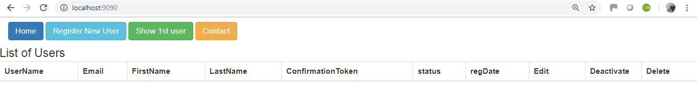
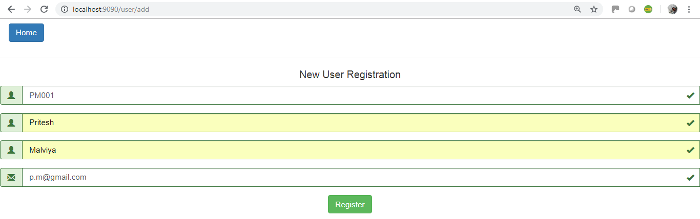
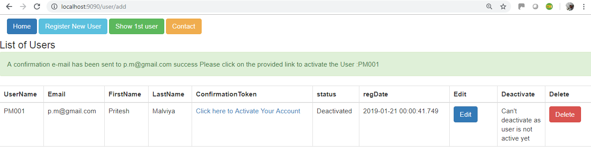
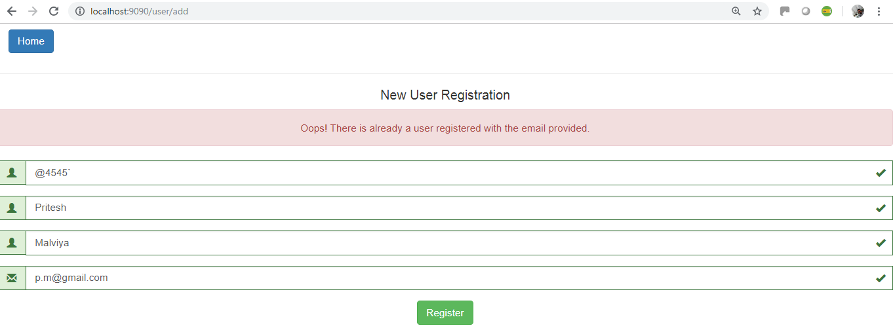
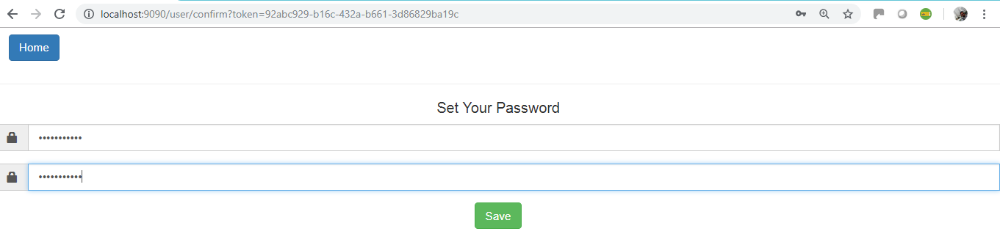
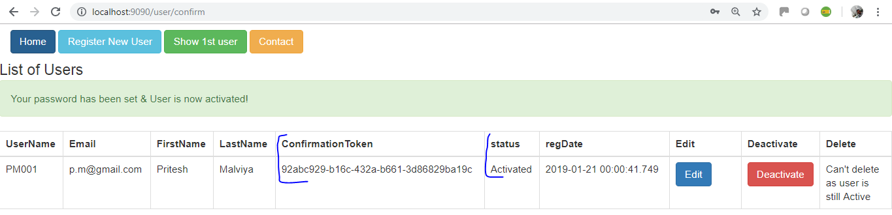
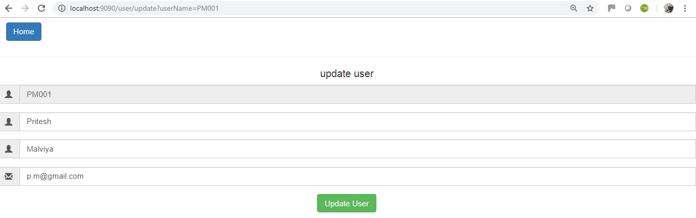
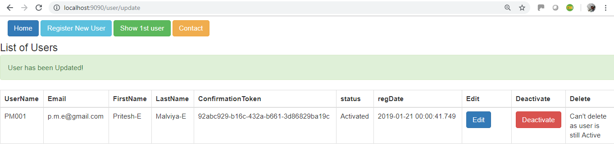

# assignment-user-reg-login
Spring based web application with a controller exposing API's for CRUD operation on user's profile
## ----------------------------------------------------------------------------------
## ---------------------------- Assignment Summary ----------------------------
## ----------------------------------------------------------------------------------
```
Dear Reviewer,

Thanks for giving me this opportunity to work on this assignment.
I am glad i have got the above artifact with clear scenarios of the assignment. PFB below the summary of the efforts
```
## Get started

### Assignment Development approach & project development summary:

I started with the `Test Driven Development (TDD)` first using `JUnit`-Using Spring test and simple Junit.[Please note] due to time constraint and issue faced during the integrated testing I commented few of the test scenerios where service call is made via JUnit to test it else it where failing the build.

### Technology Stack

* **Framework     :** `Spring-Boot (2.0.3)`
* **Testing Api's :** `Junit, SpringBootTest`
* **build tool    :** `Maven`
* **Cache         :** ``
* **Java Version  :** `1.8`
* **Java IDE      :** `IntelliJ IDEA (JetBrains)`
* **Design Patters:** 
[Creational Design Patterns used]
`- Abstract Factory, Builder, Prototype`
[Structural Design Patterns used]
`Adapter, Decorator, Facade`
[Behavior Design Patterns]
`- Chain of Responsibility, Iterator, Mediator, Template Method`
* **Other API features:** `springfox-swagger, lombok`


### Internal Architecture
The **Spring Service** itself has a pretty common internal architecture:

  * `Controller` classes provide _REST_ endpoints and deal with _HTTP_ requests and responses.
  * `service` classes takes controller calls and do the business logic which in response return the requested value as needed.In our case it fetches `list of users` _JSON_ via _HTTP_ GET, POST, PUT & DELETE request and `List of Active/Deactive` users via GET request.

  ```
  Request  ┌────────── Spring Service ───────────┐
   ─────────→ ┌─────────────┐    ┌─────────────┐ │   ┌─────────────┐
   ←───────── │  Controller │ ←→ │  ☕Services  │←--→ | ☁ H2 DB │
  Response │  └─────────────┘    └─────────────┘ │   └─────────────┘
           └─────────────────────────────────────┘
  ```  
  Application have got Crud functionalities as: 
  - create user;
  - read user;
  - update user;
  - delete user;
  
  ### How to build & run the application: 
  * I am using IntelliJ maven plugin to test and deploy but there are couple of other ways you can achive this by using CLI tools. 


use below **URL's** to test application on web browser: 
  ```
  http://localhost:9091/
  or
  http://localhost:9091/home
  or
  http://localhost:9091/welcome
  or
  http://localhost:9091/assignement
  ```
 <h3>AMDOCS User Registration HOME</h3>
 
 All Users list you can see along with other functionalities available at HOME
 
 <h3>New user adding</h3>

New User can registrate using this. New user adding function calling on dinamical modal.

<h3>New user added Successfully</h3>

New User can registrate using this. New user adding function calling on dinamical modal.

<h3>New user added UnSuccessfully</h3>

New user creacreation failed with given error.

<h3>User Confirmation</h3>

After User sucessfull registration a sucess email with associated token sent on registered email.

<h3>User Confirmation Successful</h3>

User Confirmation Successful

<h3>Existing user updating</h3>

User can update existing entities.

<h3>Edit User Confirmation</h3>

User Confirmation Editted Successful


<h3>Existing user removing</h3>

User can remove existing intities.


### Swagger API URL of the application
```
http://localhost:9091/swagger-ui.html
```
